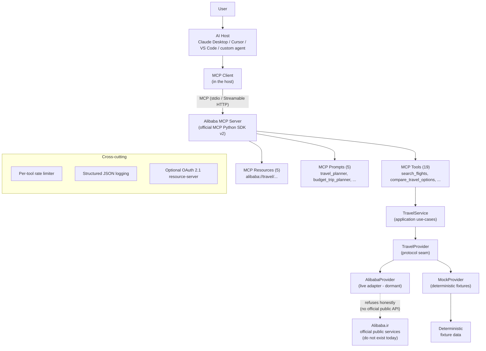

# Alibaba MCP

[](https://github.com/omid-moradi/alibaba-mcp/actions/workflows/ci.yml)
[](https://github.com/omid-moradi/alibaba-mcp/actions/workflows/inspector.yml)
[](https://www.python.org/downloads/)
[](LICENSE)

> **Disclaimer:** Alibaba MCP is an unofficial educational and portfolio
> project. It is **not** affiliated with, endorsed by, or officially
> supported by Alibaba.ir (Alibaba Travels Co.). It is not an official
> Alibaba.ir product, API, or integration.

A production-oriented [Model Context Protocol](https://modelcontextprotocol.io/)
server that exposes Alibaba.ir-style travel discovery capabilities —
flights, hotels, trains, buses, tours, comparisons, cost breakdowns and a
policy knowledge base — to AI agents, built on the **official MCP Python
SDK v2**.

> **Data status:** Alibaba.ir publishes **no official public API**, and its
> internal endpoints are undocumented and protected (see
> [docs/live-integration-notes.md](docs/live-integration-notes.md)). The
> server therefore runs on a **deterministic mock provider** by default,
> with every result clearly labeled `is_mock_data: true`. A live-provider
> adapter seam is fully wired and honestly refuses to fabricate data until
> a legitimate official API exists.

## Why MCP?

**Traditional API integration** hard-wires one client to one API: every
new consumer re-implements auth, schemas, retries and error handling.

**MCP-based agent integration** inverts this: the server publishes
*capabilities* (tools, resources, prompts) through a standard protocol, and
any MCP host (Claude Desktop, Cursor, VS Code, custom agents) discovers and
uses them — with schemas, validation and structured outputs handled by the
protocol.

```text
Without MCP:                          With MCP:
App ── bespoke code ──► Travel API    LLM ──MCP──► Alibaba MCP ──► Provider
                                       (any host can use it, zero glue code)
```

## What it does

Implemented and verified capabilities (mock provider):

- **Flights** — airport discovery, search (cabin class filter, per-adult Toman
  prices, cheapest-first), full flight details (baggage, refundability, charter
  vs system).
- **Hotels** — city search by dates/guests/min-stars with per-night rates,
  cancellation flags, full property details.
- **Trains** — station discovery, search, details (operator, seat class).
- **Buses** — search, details (operator, VIP vs standard).
- **Tours** — search by destination, details (inclusions, duration).
- **Planning** — cross-mode `compare_travel_options` (cheapest + fastest),
  `calculate_trip_cost` with itemized breakdown, `search_travel_policies`
  (lightweight retrieval over a policy knowledge base).
- **Sandbox bookings** — create/status/cancel, always clearly simulated
  (`simulated: true`), never touching any real system.
- **Operational hygiene** — structured JSON logging, per-tool rate limiting,
  model-readable errors, optional OAuth 2.1 resource-server auth for remote
  deployment, Docker image with healthcheck.

## Architecture



**Data flow** for a question like *"Find the cheapest flight from Tehran
to Mashhad tomorrow"*:

```text
LLM
 ↓  picks search_flights from tools/list (name + description + schema)
MCP Client
 ↓  tools/call {origin: "THR", destination: "MHD", departure_date: ...}
Alibaba MCP
 ↓  validation → rate limit → TravelService
Provider (MockProvider)
 ↓  deterministic fixture search
normalized FlightSearchResult
 ↓  structured_content (typed JSON) + content (text for the model)
LLM
 ↓
"Cheapest: IranAir IR740, 1,500,000 IRT, 98 min (simulated demo data)"
```

## Live vs Mock mode

```text
LIVE MODE  (ALIBABA_PROVIDER=live)
Alibaba MCP → AlibabaProvider → honest ProviderNotConfiguredError
               (Alibaba.ir publishes no official public API today; the
                server refuses to fabricate or scrape. No silent fallback.)

MOCK MODE  (ALIBABA_PROVIDER=mock, default)
Alibaba MCP → MockProvider → deterministic synthetic fixtures,
               every result flagged is_mock_data=true
```

The mode is explicit, logged in the `alibaba://travel/provider-status`
resource, and enforced by tests (`tests/live/test_live_smoke.py` proves
live mode never returns mock data). See
[docs/live-integration-notes.md](docs/live-integration-notes.md) for the
full investigation and the exact steps a future legitimate integration
would take.

## MCP primitives — why each capability is a Tool, Resource or Prompt

**Tools** are model-invoked *actions* (searches, calculations, sandbox
bookings). They have typed schemas, validation and structured outputs.

**Resources** are application-read *context*: policy documents, supported
cities, provider status, and a tool guide. They are static/parameterless
data the host can attach to a conversation — that's why they are not tools.

**Prompts** are user-selected *conversation starters* (slash-command style)
that steer the agent toward effective tool use.

| Primitive | Members |
|---|---|
| Tools (19) | `search_airports`, `search_flights`, `get_flight_details`, `search_hotels`, `get_hotel_details`, `search_cities`, `search_train_stations`, `search_trains`, `get_train_details`, `search_buses`, `get_bus_details`, `search_tours`, `get_tour_details`, `compare_travel_options`, `calculate_trip_cost`, `search_travel_policies`, `create_sandbox_booking`, `get_booking_status`, `cancel_sandbox_booking` |
| Resources (5) | `alibaba://travel/policies`, `alibaba://travel/cancellation-policy`, `alibaba://travel/cities`, `alibaba://travel/provider-status`, `alibaba://travel/tool-guide` |
| Prompts (5) | `travel_planner`, `flight_comparison`, `hotel_selection`, `budget_trip_planner`, `business_trip_planner` |

## Transports

| Transport | Use it for | Notes |
|---|---|---|
| **stdio** (default) | Claude Desktop, Cursor, VS Code, any local host | The host launches the server as a subprocess; no ports, no auth needed |
| **Streamable HTTP** | VPS / cloud / shared network service | Real HTTP server; pair with TLS + bearer-token auth for anything beyond localhost |
| SSE | Legacy clients only | Superseded by Streamable HTTP in the 2025-03-26 MCP revision; not used here |

## Installation

Requires [uv](https://docs.astral.sh/uv/) (or any Python 3.12+ environment).

```bash
git clone https://github.com/omid-moradi/alibaba-mcp
cd alibaba-mcp
uv sync --group dev        # pinned, reproducible install (uv.lock committed)
```

Once published/installed as a package: `uvx alibaba-mcp` (or from this
repo: `uv run alibaba-mcp`).

## Configuration

Copy [.env.example](.env.example) to `.env` and adjust. Highlights:

```ini
ALIBABA_PROVIDER=mock            # mock (default) | live (honest refusal today)
ALIBABA_MCP_HOST=127.0.0.1       # Streamable HTTP bind host
ALIBABA_MCP_PORT=8000
ALIBABA_MCP_LOG_LEVEL=INFO       # DEBUG | INFO | WARNING | ERROR
ALIBABA_MCP_RATE_LIMIT_MAX_CALLS=60   # per-tool, per 60s window (0 = off)
ALIBABA_MCP_RATE_LIMIT_WINDOW_SECONDS=60

# Optional bearer-token auth (Streamable HTTP). Set BOTH to enable:
ALIBABA_MCP_API_TOKEN=
ALIBABA_MCP_AUTH_ISSUER_URL=
ALIBABA_MCP_REQUIRED_SCOPES=travel:read
```

No secrets are hard-coded; `.env` is git-ignored.

## Running locally

```bash
# stdio (for MCP hosts — the server waits on stdin)
uv run alibaba-mcp

# Streamable HTTP (remote/networked deployment)
uv run alibaba-mcp --transport streamable-http --host 127.0.0.1 --port 8000
# → clients connect to http://127.0.0.1:8000/mcp
```

## MCP Inspector

Interactive UI (requires Node.js/npx):

```bash
uv run mcp dev server.py --with-editable .
# → open the printed URL; browse Tools / Resources / Prompts
```

Automated CLI verification (what CI runs in
[inspector.yml](.github/workflows/inspector.yml)):

```bash
# terminal 1
uv run alibaba-mcp --transport streamable-http --port 8000
# terminal 2
npx @modelcontextprotocol/inspector --cli http://127.0.0.1:8000/mcp --method tools/list
npx @modelcontextprotocol/inspector --cli http://127.0.0.1:8000/mcp --method tools/call \
  --tool-name search_flights --tool-arg origin=THR destination=MHD departure_date=2026-10-09
npx @modelcontextprotocol/inspector --cli http://127.0.0.1:8000/mcp --method resources/list
npx @modelcontextprotocol/inspector --cli http://127.0.0.1:8000/mcp --method prompts/list
```

All six operations (initialize implied, tools/list, tools/call,
resources/list, resources/read, prompts/list, prompts/get) were verified
with the official Inspector CLI — see
[docs/evaluation-report.md](docs/evaluation-report.md).

## Connect an MCP host

**Claude Desktop** (`claude_desktop_config.json`):

```json
{
  "mcpServers": {
    "alibaba-mcp": {
      "command": "uv",
      "args": ["--directory", "/absolute/path/to/alibaba-mcp", "run", "alibaba-mcp"]
    }
  }
}
```

**Cursor / VS Code** (mcp.json):

```json
{
  "mcpServers": {
    "alibaba-mcp": {
      "command": "uv",
      "args": ["--directory", "/absolute/path/to/alibaba-mcp", "run", "alibaba-mcp"]
    }
  }
}
```

**Remote (any host that supports Streamable HTTP):**

```json
{
  "mcpServers": {
    "alibaba-mcp": { "url": "http://your-server:8000/mcp" }
  }
}
```

Then just ask, e.g.: *"Find the cheapest flight from Tehran to Mashhad
tomorrow."*

## MCP client example

A real MCP client (protocol only — it never imports server code):

```bash
uv run python client/mcp_client_demo.py
# or against a running HTTP server:
uv run python client/mcp_client_demo.py --url http://127.0.0.1:8000/mcp
```

Output shows initialize → tools/list → tools/call → resources/read →
prompts/get with structured results, e.g.:

```text
=== tools/call search_flights ===
5 flights found (is_mock_data=True)
  - IranAir IR740: 1,500,000 IRT, 98 min
  ...
```

## LangGraph agent example

A ReAct agent whose *only* tools are the ones it discovers from the Alibaba
MCP server over the MCP protocol. The LLM decides which tools to call.

```bash
uv sync --group agent
uv pip install langchain-openai        # or langchain-google-genai / langchain-anthropic

export OPENAI_API_KEY=sk-...           # matching your model below
export ALIBABA_AGENT_MODEL=openai:gpt-4o-mini

uv run python examples/langgraph_agent.py "Find the cheapest flight from Tehran to Mashhad"
```

The MCP→LangChain bridge lives in
[client/mcp_langchain_bridge.py](client/mcp_langchain_bridge.py) (built on
SDK v2's `Client`; deliberately avoids `langchain-mcp-adapters`, which still
targets the v1 session API).

## Docker

```bash
docker build -t alibaba-mcp .
docker run -p 8000:8000 alibaba-mcp
# or
docker compose up
```

The image is built in two stages with `uv` (locked, deterministic install),
runs as a **non-root** user, and ships a **healthcheck that performs a real
MCP initialize** against `/mcp`. No secrets are baked in — pass
configuration via environment variables (`-e KEY=value`).

## Testing

```bash
uv run pytest                 # 59 tests: unit + MCP integration + e2e (stdio & HTTP)
uv run pytest -m live         # 3 tests asserting live-mode honesty (offline)
uv run ruff check .           # lint
uv run ruff format --check .  # formatting
uv run mypy src               # strict type check of production code
```

Test layers:

| Suite | What it covers |
|---|---|
| `tests/unit/` | domain-model validation, mock-provider determinism & error rules, rate limiter, policy retrieval, config, live-provider refusal |
| `tests/integration/` | full MCP protocol via in-memory client: discovery (19 tools / 5 resources / 5 prompts), invocation, structured output, invalid & oversized input, model-readable errors, booking lifecycle, rate limiting |
| `tests/e2e/` | stdio-subprocess and real Streamable-HTTP-server end-to-end flows |
| `tests/live/` | `-m live`: proves live mode refuses honestly and never substitutes mock data |

### Live testing

There is **no live Alibaba.ir API to test against today**. The live suite
asserts the *honest failure* instead. If a legitimate official API ever
becomes available, follow
[docs/live-integration-notes.md](docs/live-integration-notes.md) to wire it
in, then replace those assertions with real read-only smoke tests.

## Evaluation

```bash
uv run python scripts/evaluate.py   # writes docs/evaluation-report.md
```

Measures tool discoverability (intent keywords in tool descriptions), the
argument contract (schema vs canonical args), invocation success,
structured-output shape, error behavior and end-to-end latency — with real
Measured values only. Latest run: **4/4 cases passing**, median tool-call
latency ~23 ms (in-memory transport, mock provider). See
[docs/evaluation-report.md](docs/evaluation-report.md).

## Security

See [SECURITY.md](SECURITY.md) for the full policy. Highlights:

- **Trust boundaries**: stdio is local-trust; Streamable HTTP is a network
  service — put it behind TLS and enable the built-in bearer-token
  authorization (OAuth 2.1 resource-server pattern per the official SDK:
  verify tokens, never issue them).
- **Input/output validation**: strict Pydantic models (`extra="forbid"`),
  schema-rejected bad arguments, bounded result sizes.
- **Rate limiting**: per-tool sliding window with model-readable errors;
  never bypassed.
- **Secrets**: environment-only; never logged (logging fields are
  whitelisted); `.env` git-ignored.
- **No side effects on real systems**: bookings are simulated sandbox
  objects; the live provider categorically refuses them.

## Project layout

```text
src/alibaba_mcp/
├── domain/           # normalized Pydantic models & enums (pure, no I/O)
├── providers/        # TravelProvider protocol; mock.py; alibaba/ (live seam)
├── application/      # TravelService use-cases + policy knowledge base
├── mcp/              # tools/ (6 modules), resources/, prompts/, context
├── infrastructure/   # JSON logging, rate limiter, observability decorator
├── config.py         # pydantic-settings (env-based)
├── server.py         # MCPServer assembly (+ optional auth)
└── __main__.py       # CLI: stdio | streamable-http
client/               # real MCP client demo + MCP→LangChain bridge
examples/             # LangGraph agent
tests/                # unit / integration / e2e / live-marker
scripts/              # evaluate.py, healthcheck.py, smoke checks
docs/                 # live-integration notes, evaluation report
```

## Limitations (be aware)

1. **No real Alibaba.ir data.** Every result is simulated and labeled as
   such. Live mode is an honest placeholder (see
   [docs/live-integration-notes.md](docs/live-integration-notes.md)).
2. **Bookings are sandbox-only** and disappear on server restart — by
   design; side effects on real systems are out of scope.
3. **Policy texts are generic educational content**, not official
   Alibaba.ir policies.
4. **Rate limiting is in-process** (fine for single-instance; a Redis-backed
   implementation would be needed for multi-replica deployments).
5. **The static-token verifier is a demo**; production should verify JWTs
   or use introspection.

## Architecture decisions (the WHY)

- **Official MCP Python SDK v2** (`mcp` 2.x) rather than standalone
  FastMCP: the official SDK is the standard, and v2 renamed
  `FastMCP`→`MCPServer` with a first-class `Client`. All APIs were verified
  against the current docs — no deprecated v1 imports.
- **Provider seam, not scraping**: tools talk to `TravelProvider` only.
  This keeps MCP logic stable if a real API appears (or changes), and makes
  the honest live-mode refusal a one-file decision.
- **Deterministic, ID-encoded mock data**: results are derived from
  blake2b digests of (route, date, sequence), so the same query always
  yields the same results and `get_*_details` can regenerate any item from
  its id — stateless, reproducible, CI-friendly, no database needed.
- **No database / no Redis**: with deterministic fixtures and in-process
  bookings, infrastructure would be unjustified complexity. The seams
  (provider, limiter interface) document exactly where they'd slot in.
- **Custom MCP→LangChain bridge**: `langchain-mcp-adapters` still targets
  the v1 SDK; a 70-line bridge on the v2 `Client` avoids dependency
  conflicts and shows exactly what tool-bridging involves.
- **`is_mock_data` on every search result**: LLM-facing honesty by
  construction — an agent can never present demo data as real inventory.
- **Sandbox bookings annotated `destructive_hint: true`**: well-behaved
  hosts will confirm with the user before invoking them.

## Roadmap

**Implemented:** everything listed in "What it does", plus both transports,
Inspector verification, evaluation suite, Docker, CI, auth seam.

**Planned (NOT implemented):**
- Live Alibaba.ir provider — only if/when an official public API exists
- Redis-backed distributed rate limiting & caching
- JWT-based token verification (production-ready verifier)
- OpenTelemetry metrics exporter
- Round-trip (return-date) flight search and multi-city itineraries
- Vector-based policy RAG behind the same `search_travel_policies` contract
- Publication on PyPI for true `uvx alibaba-mcp` installs

## License

[MIT](LICENSE) — with the reminder that this project is unofficial and not
affiliated with Alibaba.ir.


